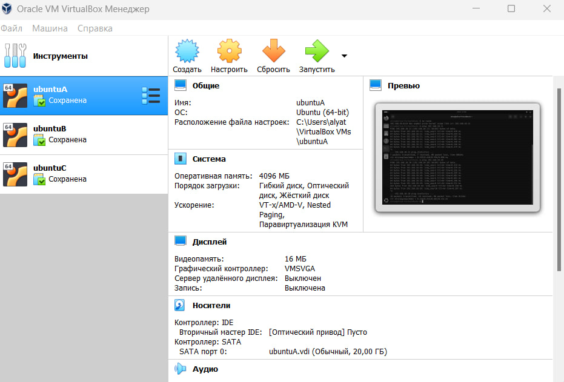
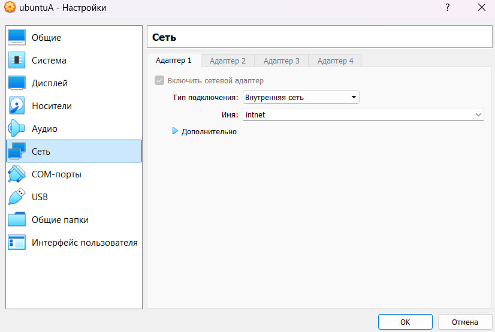
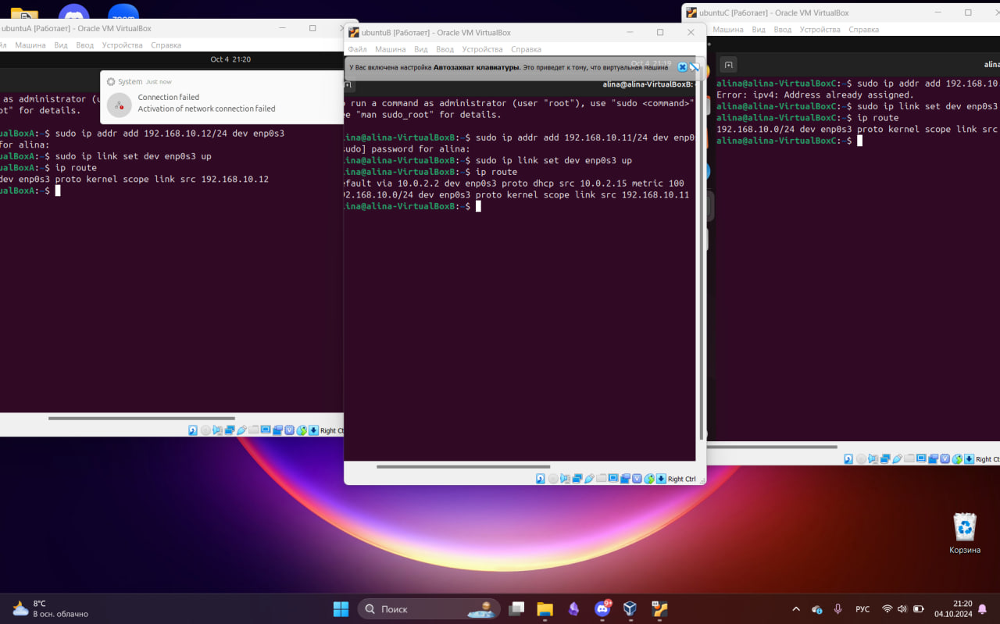
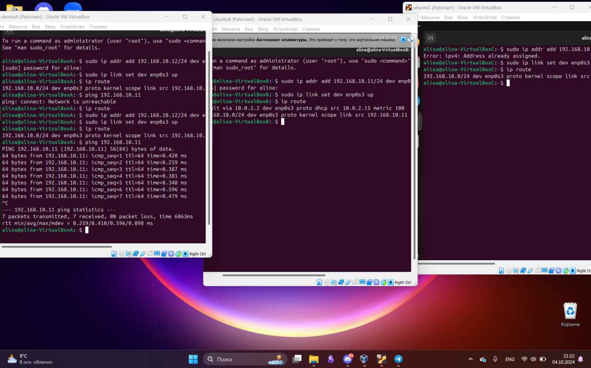
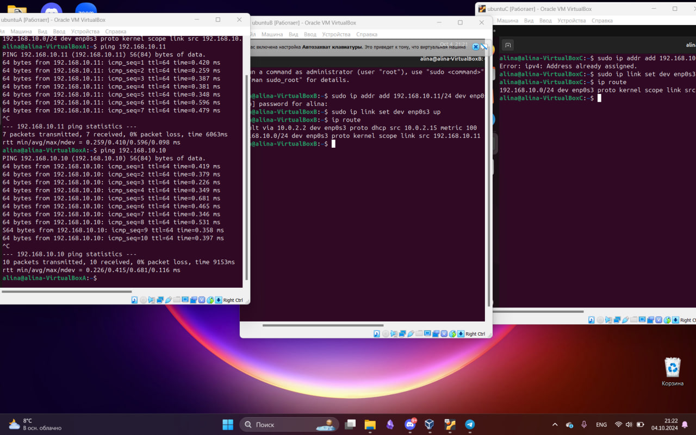
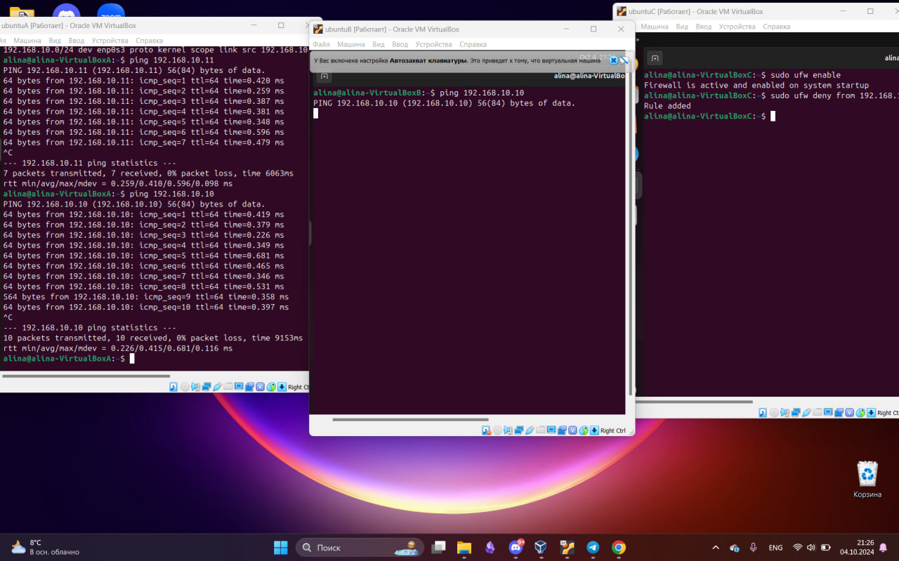

# Лабораторная работа №3. Виртуализация.

## Ход работы:

### 1. Создание виртуальных машин:
#### Я скачала Oracle VirtualBox 6.0 на официальном сайте. После установки я приступила к созданию трех виртуальных машин: А, B и C. Для всех машин я указала ОС Linux Ubuntu и добавила iso образ. Я выделила каждой по 4 ГБ ОЗУ и по 20 ГБ на виртуальный жесткий диск.
 

### 2. Настройка виртуальных машин:
#### Я зашла в настройки каждой ВМ и в разделе "Сеть" поменяла тип подключения NAT на "Внутренняя сеть".

### 3. Настройка сетевых маршрутов:
#### Я настроила сетевые интерфейсы и маршруты для каждой виртуальной машины, назначив им уникальные IP-адреса

### 4. Настройка сетевого доступа между А и B:
#### C помощью команды ping удалось проверить доступность машины B с машины А

### 5. Настройка сетевого доступа между А и С:
#### Аналогично пункту 4:

### 6. Запрет доступа от машины В к машине С:
#### Я запретила доступ для машины В от машины С с помощью команд sudo ufw enable, sudo ufw deny. При попытке пинга с машины В мы видим, что доступ заблокирован

## Вывод:
#### Я получила опыт работы с виртуальными машинами, а так же научилась связывать их между собой. Было достаточно трудно.
