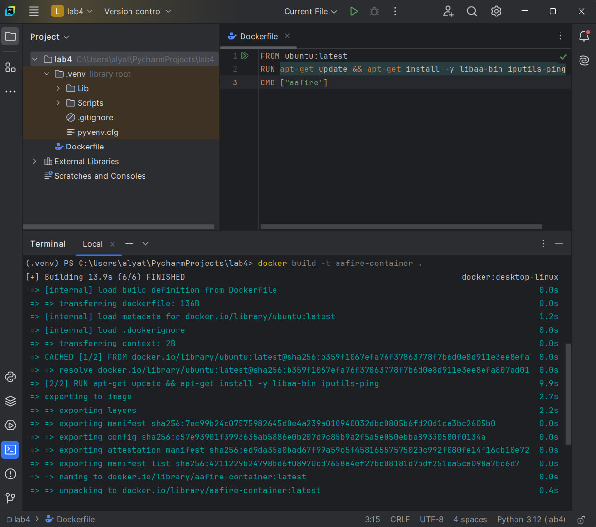
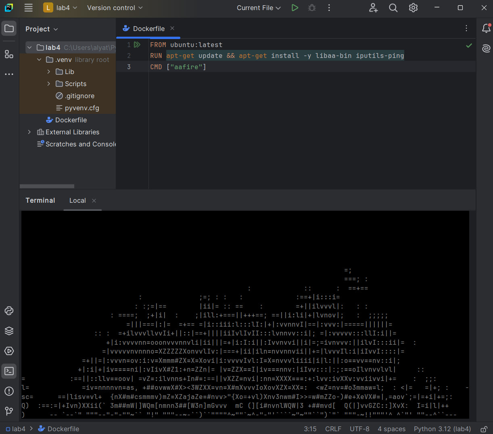
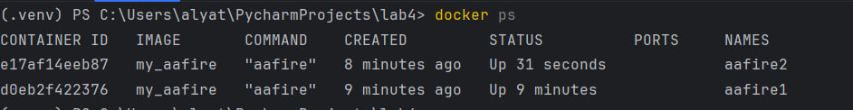
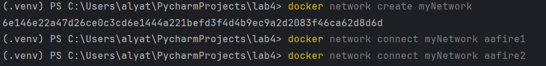
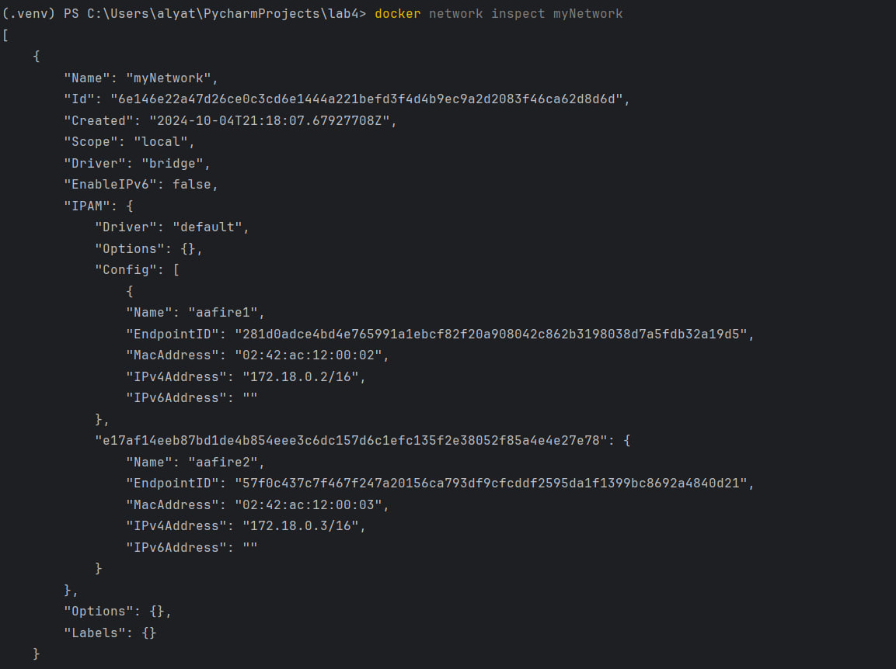
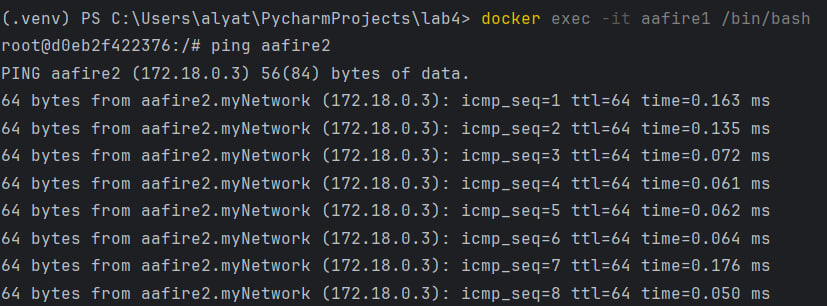
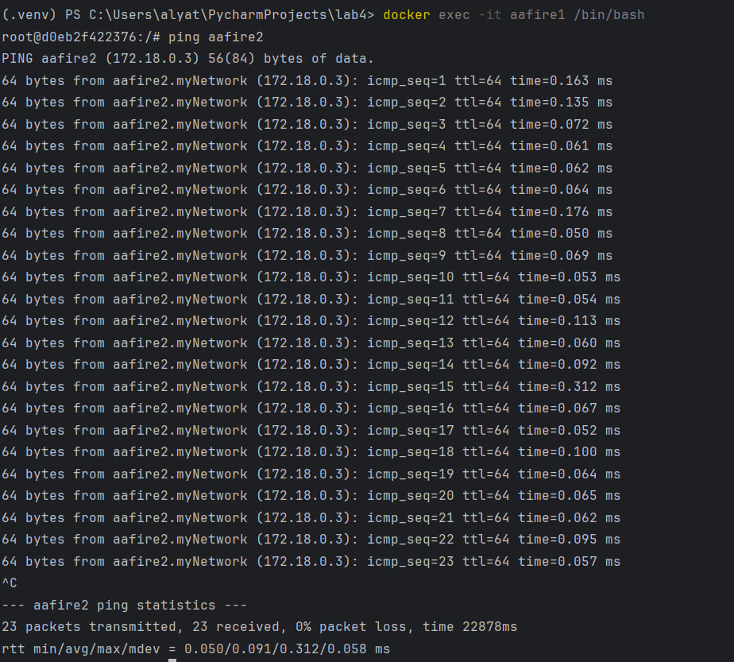

# Лабораторная работа 4.

### 1. Установка Docker и создание Dockerfile:
#### Я скачала докер на официальном сайте, а также авторизовалась в системе. Далее создала докерфайл в PyCharm, установив необходимый плагин.

### 2. Dockerfile и сборка образа:
#### Я прописала в докерфайле обновление пакетного менеджера и установила библиотеку libaa-bi, а так же заранее установила утилиту ping. С помощью команды docker build -t my_aafire я запустила сборку образа.

### 3. Запуск контейнера:
#### Далее я подключила и запустила контейнеры с помощью команд docker run -it --name aafire1 my_aafire; docker run -it --name aafire2 my_aafire. Приложение бесконечное, поэтому контейнер не отключался автоматически.

### 4. Просмотр запущенных контейнеров:
#### Чтобы убедиться, что оба контейнера запущены я использовала комнаду docker ps. Все оказалось правильным.

### 5. Создание и сети и подключение:
#### Я создала сеть myNetwork при помощи команды docker network create myNetwork. После этого я подключила контейнеры к этой сети.

### 6. Просмотр настроек созданной сети:
#### Здесь я увидела IPv4 адреса для каждого подключенного контейнера

### 7. Тест соединения между контейнерами:
#### Используя ранее установленную утилиту ping внутри каждого из контейнеров, я проверяю, отвечают ли они на запросы друг друга. Система работает корректно, и контейнеры могут обмениваться данными.

## Вывод: я впервые поработала с Docker. У меня получилось верно создать докерфайл, запустить контейнеры и настроить сеть между ними. Было интересно.

