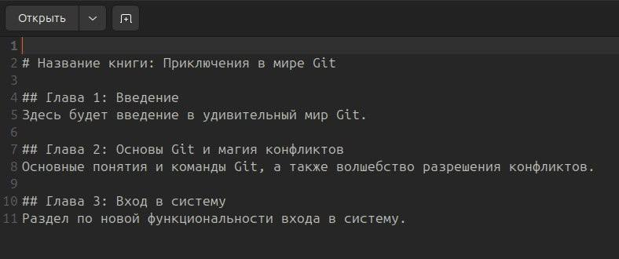

# Лабораторная работа №5

## 1. Введение:
#### 1.1 Я вошла в свою учетную запись на GitHub и создала новый репозиторий "lab5-wurlinney", сделав его приватным.
#### 1.2 Я клонировала этот репозиторий на свой ПК с помощью команды git clone
#### 1.3 Я создала файл example.txt в папке с локальной копией репозитория, добавила в него текст:

### Далее я загрузила файл на Github:

#### 1.4 С помощью команды "git checkout -b feature-branch" я создала новую ветку, а затем изменила в ней файл example.txt следующим образом:

#### 1.5 После этого я загрузила измененный файл в новой ветке на Github:

#### 1.6 Переключившись обратно на мейн, я замерджила feature-branch и отправила изменения на гитхаб:

## 2. Работа с ветками:
#### 2.1 Я создала файл book.txt со следующим содержанием:

#### 2.2 Далее с помощью команды "git checkout -b feature-login" я создала новую ветку и изменила в ней файл book.txt:

#### 2.3 После этого я запушила изменения:

## 3. Работа с удаленным репозиторием:

#### 3.1 Я переключилась на main и внесла изменения в основной ветке:

#### 3.2 А потом закоммитила изменения и отправила их на гитхаб:

## 4. Моделирование конфликта:
#### 4.1 Вернувшись в ветку feature-login, я изменила вторую главу в файле книги:

#### 4.2 Закоммитила изменения и отправила их на гитхаб:

## 5. Разрешение конфликта:
#### 5.1 Возвращаюсь в мейн и пробую слить изменения:

#### 5.2 Возникает конфликт. Исправляю файл:

#### 5.3 Коммичу разрешение конфликта и отправляю на гитхаб:

## 6. Автоматизация проверки формата файлов при коммите:
#### 6.1 Создаю bash-скрипт (check_format.sh), который будет выполнять проверку формата .txt файлов:

#### 6.2 Используя как инструмент grep, создаю сам скрипт:

#### 6.3 Добавляю скрипт в репозиторий, поместив в папку .git/hooks и убедившись, что у него есть права на выполнение:

#### 6.4 Пробую внести изменения и закоммитить, при этом для проверки добавив пустые .txt и не .txt файлы:

## 7. Использование Git Flow в проекте:
#### 7.1 Установив Git Flow, провожу инициализацию:

#### 7.2 Создаю ветку для новой функциональности "task-management", добавляю файл с кодом и коммичу:

#### 7.3 Завершаю фичу и объединяю ее с основной веткой:

#### 7.4 Переключившись на ветку develop, начинаю создание релиза:

#### 7.5 Вношу изменения, связанные с релизом:

#### 7.6 Завершаю релиз и объединяю его с ветками develop, main:

